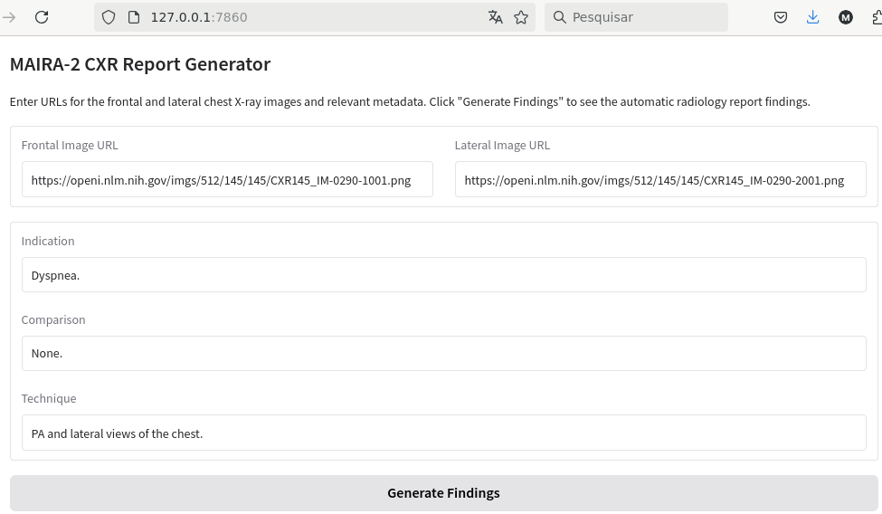

# MAIRA-2 CXR Report Generator

This project implements a Gradio-based application that utilizes the MAIRA-2 model from Microsoft to generate radiology reports from chest X-ray images. Users can input URLs for frontal and lateral chest X-ray images, along with relevant clinical information, to automatically generate findings.

## Features

*   **Image Input:** Accepts URLs for frontal and lateral chest X-ray images.
*   **Clinical Context:** Enables input of clinical indications, comparison studies, and technical details of the X-ray.
*   **Automated Report Generation:** Leverages the MAIRA-2 model to generate findings based on the provided information.
*   **Gradio Interface:** Provides an intuitive web interface for effortless interaction.
    
    *Application Screenshot*

## Requirements

*   Python 3.7 or higher
*   The following Python packages (see `requirements.txt`):
    *   `transformers`
    *   `torch`
    *   `huggingface_hub`
    *   `requests`
    *   `Pillow (PIL)`
    *   `gradio`
    *   `sentencepiece`
    *   `protobuf`

## Installation

1.  Clone the repository:

    ```bash
    git clone https://github.com/mvdiogo/MAIRA-2-CXR-Report-Generator.git
    cd MAIRA-2-CXR-Report-Generator 
    ```

2.  Create a virtual environment (optional but recommended):

    ```bash
    python -m venv venv
    source venv/bin/activate  # On Linux/macOS
    venv\Scripts\activate  # On Windows
    ```

3.  Install the required packages:

    ```bash
    pip install -r requirements.txt
    pip install --force-reinstall git+https://github.com/huggingface/transformers.git@88d960937c81a32bfb63356a2e8ecf7999619681
    ```

4.  Install PyTorch:

    Refer to the official PyTorch website for installation instructions specific to your system:  [https://pytorch.org/get-started/locally/](https://pytorch.org/get-started/locally/)

## Usage

1.  **Hugging Face Token:**

    To access the gated MAIRA-2 model, you'll need a Hugging Face token and permission.

    *   **Request Access:**  Go to [https://huggingface.co/microsoft/maira-2/tree/main](https://huggingface.co/microsoft/maira-2/tree/main) and request access to the model.
    *   **Generate Token:**  Create a Hugging Face token with read access at [https://huggingface.co/settings/tokens](https://huggingface.co/settings/tokens).
    *   **Set Environment Variable:**  Set the `HF_TOKEN` environment variable (replace `"your_huggingface_token"` with your actual token):

        ```bash
        export HF_TOKEN="your_huggingface_token"  # Linux/macOS
        set HF_TOKEN="your_huggingface_token"       # Windows
        ```

        **Important:** This is for development/testing only. For production environments, use secure methods for storing and accessing credentials. Never commit your token to public repositories.

2.  Run the application:

    ```bash
    python main.py
    ```

3.  Open the URL provided in the console in your web browser.  This will typically be something like `http://127.0.0.1:7860` or a `gradio.live` URL.

4.  Enter the URLs for the frontal and lateral chest X-ray images, along with the indication, comparison, and technique.

5.  Click the "Generate Findings" button to generate the radiology report findings.

## Notes

*   The quality of the generated reports depends on the quality of the input images and the capabilities of the MAIRA-2 model.  Experiment with different prompts and settings to optimize results.

## Disclaimer

This project is for demonstration and educational purposes only and should not be used for clinical decision-making. Always consult with qualified healthcare professionals for medical advice.
